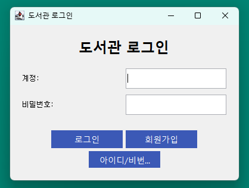
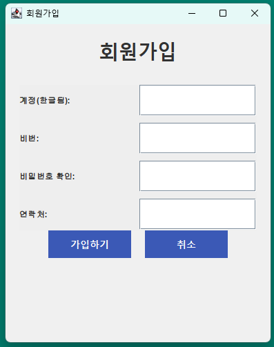

# 프로젝트 목표
1. 프로젝트 관리와 목표 달성을 위한 협업 커뮤니케이션 역량 강화 
2. 팀프로젝트 환경에서 코드 형상관리법 학습하기    
3. 자바와 RDBMS 

# 프로젝트 진행 과정

우리는 5명의 팀원으로 프로젝트 팀이 구성되었습니다.
팀 구성 
김동진,홍엽,서준호,김동훈,신한

### 개발 환경

- 개발환경 window 11 64bit
- 개발 도구 Eclips, intellij
- 개발 언어및 라이브러리 : java , awt(awt,swing)
- DB : Oracle 11g
- 테스트 툴 : jUnit
- 형상관리와 전략:  github / gitflow 전략.

### 다이어그램

#### 디렉토리 구조.
src
└── main
├── java
│   └── com
│       └── bookstore
│           ├── model
│           ├── controller
│           ├── dao
│           ├── service
│           ├── view
│
└── resources

##### 각 패키지의 역할:

model: 데이터 모델
dao: 데이터베이스 접근 객체(DAO) 클래스
service: 비즈니스 로직 처리하는
view: GUI
controller: 모델과 뷰 사이의 상호작용을 관리하는 컨트롤러 클래스들
util: 데이터베이스 연결

### 팀 구성 및 역할
 (팀장)홍엽 - 리소스 할당/ 관리와 조정 / 코드 개발(기능 구현 위주)
 김동훈 - 코드 개발(기능 구현 위주)
 김동진 - 코드 개발(기능 구현 위주)
 서준호 - 테이블 설계 위주 
 신한 - 코드 개발(형상 관리 위주)

아직 프로젝트의 진행 순서나 팀적인 규칙 등을 어떻게 정하고 진행해야 하는지 모르는 부분이 많았습니다.

그래서 클로드,챗gpt 등의 open ai 챗봇을 활용하여 힌트를 얻고 

각종 블로그와 유튜브 영상과 깃허브 오픈 리포지토리들을 참조하며 프로젝트를 완성했습니다.

프로젝트의 진행은 시간상으로는 3 파트로 나눴습니다.

## 1. 주제 선정, 설계도 작성 , 요구사항 정의 및 분석. 

주제와 구현하고 싶은 기능을 정하고 도메인 분석, 요구사항 정의, 유즈케이스작성,ERD 설계,API 설계 및 우선순위 상에 속한 요구사항을 정했습니다.

## 2. 코드 개발

(주요 기능 소개)

## 3. 프리젠테이션 준비와 회고록 작성 

### 기술적 도전과 문제점 발견과 해결책.

- 역할 분배가 어려웠습다.

- UI 템플릿을 사용하려했지만 버전 호환성 문제로 기존 코드와 융합이 안됐습니다.

- 마무리 단계에서 Git-Flow를 브랜치 전략 체결

 
# 코드 소개, 주요 기능 시연
- dao 기능

- view 기능

- controller 기능

각 컨트롤러는 해당 서비스와 패널(뷰)을 가지고 있으며,
뷰의 이벤트 리스너를 초기화하고 관리합니다.
입력을 받고 view에 model데이터를 뿌려줍니다.

인터페이스를 통해 의존성 주입에 용의하게 했습니다.

- service 기능

# DEMO

# Q&A 세션 

